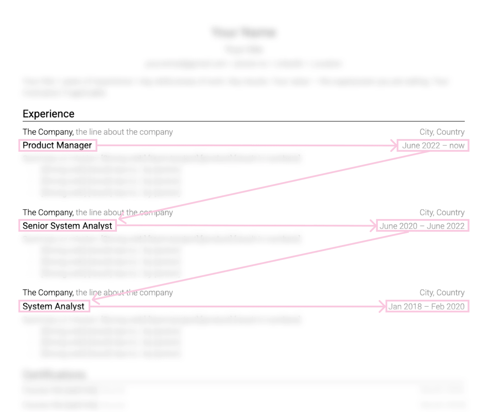

# Structure an experience entry

Each role needs enough context to be understood without a cover letter:

- organization;
- official or accurately translated title;
- location or remote status;
- month and year range;
- one short line of context when the organization is unfamiliar;
- two to six relevant bullets.

Use reverse chronology. Within each role, order bullets by relevance and strength rather than by the date each task happened.

Keep an organization's description factual. "Regional food distributor serving 120 stores" helps. "Innovative market leader" does not.

Do not merge separate jobs to hide gaps or promotions. If you held several roles at one organization, group them under the organization and show each title with its dates. Readers should be able to reconstruct the timeline.

