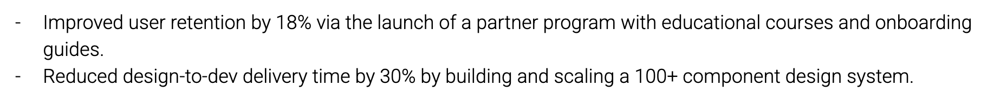
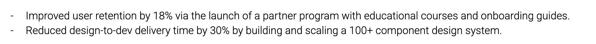
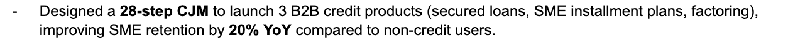

# Write strong experience bullets

A useful bullet explains what changed and how you contributed. Start with a specific verb, name the work, and add a verified result, scale, or constraint.

Weak:

> Responsible for managing customer support.

Stronger:

> Reorganized the support queue by issue type and cut median first-response time from 11 hours to 6 hours.

Results do not have to be revenue. Useful evidence includes time saved, error rate, volume, adoption, completion rate, team size, budget, accessibility, risk reduction, publication, or delivery under a hard constraint.

Examples across professions:

- Engineered an idempotent import service that processed 9 million records per day with no duplicate customer entries.
- Redesigned the checkout flow after 18 usability sessions and increased completion by 14\%.
- Negotiated new carrier terms across five warehouses and reduced annual freight spend by \$420,000.
- Set portfolio priorities for a \$36 million product line and stopped three initiatives that did not meet retention targets.
- Coordinated a community vaccination clinic serving 1,800 residents over six weekends.

Use a precise nonnumeric outcome when no reliable metric exists:

> Created the incident handoff checklist adopted by all four regional operations teams.

Do not turn participation into ownership. "Contributed to" is correct when responsibility was shared. Strong writing is not the same as claiming sole credit.

