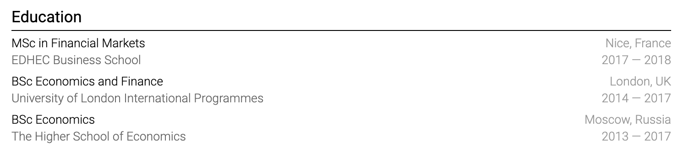
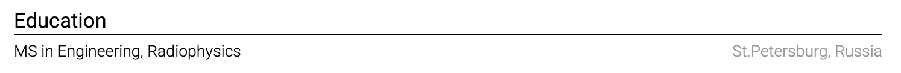
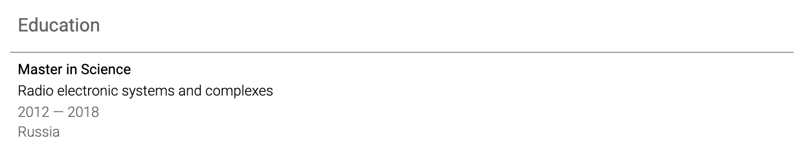

# Present education

List the qualification, institution, location when useful, and completion year. Add the expected completion date for a program in progress.

Recent graduates can include selected coursework, a thesis, awards, or student leadership when it supports the target role. Experienced candidates usually need only the qualification and institution.

Do not list a degree as completed if you did not complete it. Use wording such as "Coursework toward BSc in Economics, 2021 to 2023" when that history is relevant.

GPA is useful when it is strong, recent, and understood in the target market. Give the scale, for example `3.8/4.0`.

