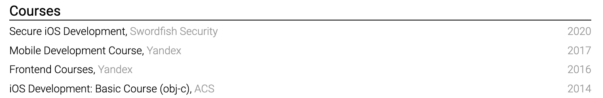
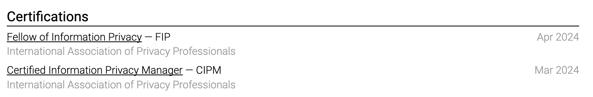

# Choose courses and certifications

Include a certification when it is required, recognized in the field, recent enough to matter, or evidence of a skill not shown elsewhere.

Use the official credential name, issuing organization, issue date, and expiry date when applicable. Add a credential link or ID if a reviewer can verify it.

Short online courses rarely deserve space once professional experience demonstrates the same skill. A long course list can make senior experience look less substantial. Select two or three that help the specific application.

Never imply that attendance is certification. Write "Completed course" when no assessed credential was awarded.

