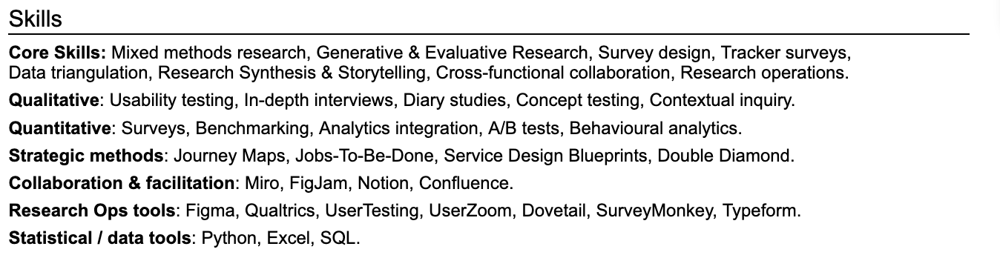
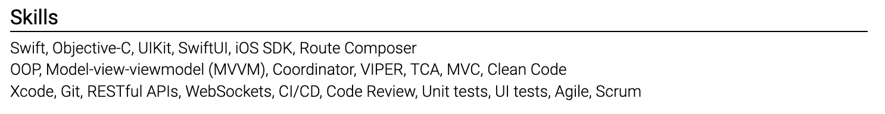
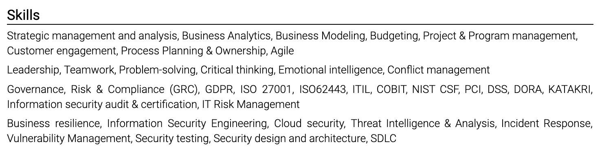

# Select skills

The skills section is an index to evidence elsewhere in the resume. Choose terms that match the target role and that you could discuss in an interview.

Group skills in a way that suits the profession:

- developer: languages, data, platforms, and practices;
- designer: research, interaction, visual design, systems, and tools;
- product leader: portfolio strategy, pricing, discovery, operating models, and commercial ownership;
- operations professional: planning, safety, procurement, process improvement, and systems.

Do not score yourself with stars or percentages. "Figma, advanced" is still subjective. Work samples and experience bullets provide stronger evidence.

Remove generic traits such as communication, leadership, and teamwork unless a specific hiring process asks for them. Demonstrate those traits through outcomes.

