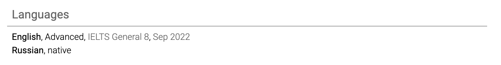
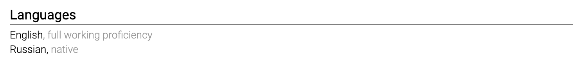
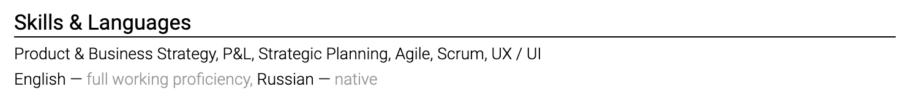

# State language proficiency

Use a recognized scale when language ability matters. The CEFR scale runs from A1 to C2. Plain descriptions such as native, professional working proficiency, and conversational are also understandable.

Do not overstate fluency. Interviews often test it immediately. If a role requires a specific language, place the language section where it is easy to find.

You do not need to list the language in which the entire resume and hiring process are conducted unless the market expects it or you want to clarify a multilingual profile.

