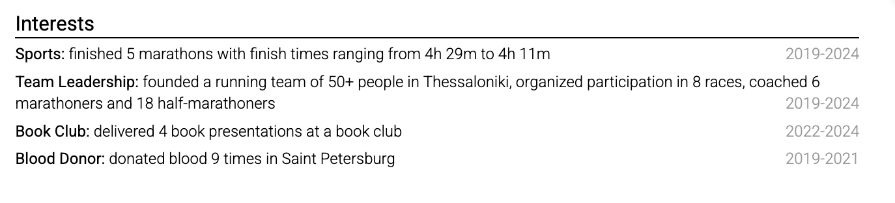

# Use interests selectively

Interests are optional. Include them when they add evidence, make a credible connection to the work, or show a substantial achievement.

"Running" says little. "Completed four trail ultramarathons and organized a weekly club for 60 runners" shows sustained effort and community work.

Keep the section short. Do not use it to fill space that should contain experience, projects, education, or verified skills. Avoid personal details that could expose you to bias or create a safety risk.

