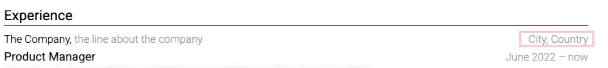

# Add company context

Recruiters may not know a small employer, nonprofit, public agency, or internal business unit. One short description can explain the domain and scale.

Useful:

> Regional logistics provider operating 14 distribution centers in the Midwest.

Not useful:

> Fast-growing, innovative company transforming the future of logistics.

Use public facts or facts you are allowed to disclose. Relevant context may include customer type, geography, operating scale, funding stage, or product category. Avoid marketing language and confidential revenue.

If the employer is widely understood in the target market, skip the description. Use the saved space for your work.

