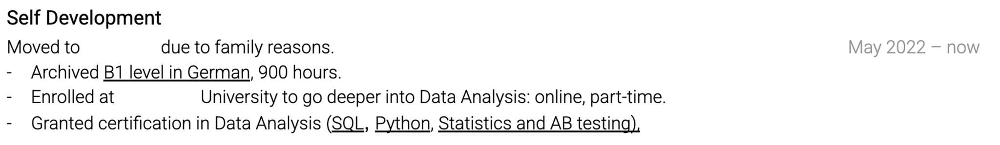
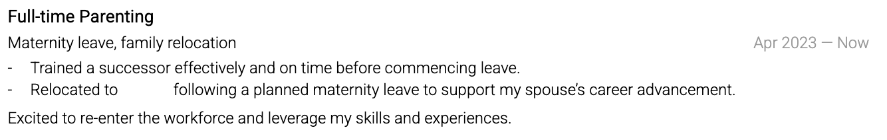
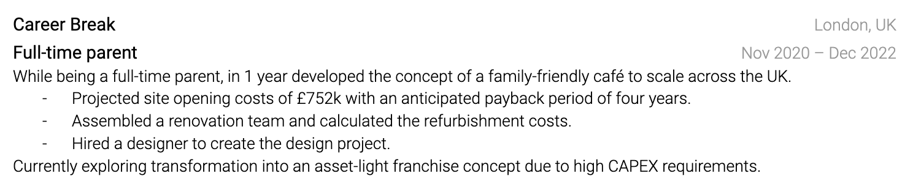

# Handle unusual career histories

Clarity works better than concealment.

## Career gaps

Use years instead of months only if you use that format consistently. A short entry can explain substantial caregiving, study, public service, travel, or recovery when you want to provide context. You do not owe medical or family details.

## Career changes

Lead with transferable evidence and recent proof of the new direction. A former teacher moving into operations might emphasize scheduling, budgets, process design, and stakeholder coordination, then add a relevant project or qualification.

## Short roles

Keep a short role if it adds relevant evidence or prevents a confusing gap. Label a contract as a contract. Several consulting engagements can be grouped under one self-employment entry.

## A lower title

Titles vary between organizations. Keep the official title and use bullets to show scope. If you deliberately moved from management to individual contribution, a short explanation can prevent the reader from guessing.

Never change dates or titles to make the timeline look smoother. Prepare a direct interview explanation instead.

